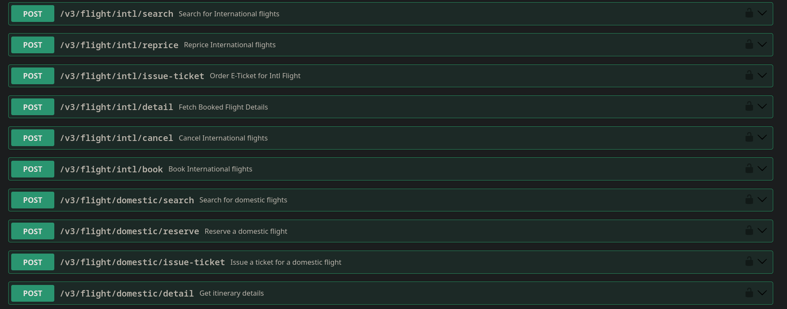

# ✈️ FlyNepal API – Domestic Flights (Plazma API)

This folder contains code and examples demonstrating how the **domestic flights API (Plazma API)** is working.

For **all domestic flight endpoints**, please refer to the official **Swagger documentation**:

👉 [FlyNepal Swagger UI](https://api.flynepal.com/swagger-ui/index.html)

Below is a preview screenshot (`list.png`):

